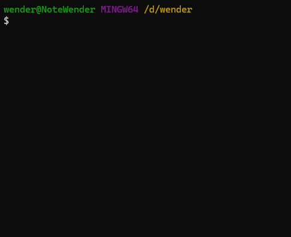

# BoilerplateCLI



Este projeto visa agilizar toda estrutura de micro-saas para testar ideias rápidas fornecendo:

- Autenticação
- Tela de Login
- Componentes
- ORM

## Como rodar

na pasta base rode o comando abaixo, isso vai fazer o terminal reconhecer o comando `boilerplate`:
```bash
npm link
```

### Criando o boilerplate
Para criar a estrutura basta dar o new  e o nome do projeto que o mesmo é criado, está usando `npm` na primeira versao,
mas a vontade é expandir para outros gerenciadores javascript.

```bash
boilerplate new <nome-projeto>
```

## Gratidão

Esse projeto é para ajudar a comunidade e crescer sempre mais e mais, o conhecimento compartilhado sempre retorna.
